# COLOR_CONVERSIONS_OF-IMAGE
## AIM
To write a python program using OpenCV to do the following image manipulations.

i) Read, display, and write an image.

ii) Access the rows and columns in an image.

iii) Cut and paste a small portion of the image.

iv)To perform the color conversion between RGB, BGR, HSV, and YCbCr color models.


## Software Required:
Anaconda - Python 3.7
## Algorithm:
### Step 1: 
Choose an image and save it as a filename.jpg.
### Step 2: 
Use imread(filename, flags) to read the file.
### Step 3: 
Use imshow(window_name, image) to display the image.
### Step 4: 
Use imwrite(filename, image) to write the image.
### Step 5: 
End the program and close the output image windows.
### Step 6: 
Convert BGR and RGB to HSV and GRAY
### Step 7: 
Convert HSV to RGB and BGR
### Step 8: 
Convert RGB and BGR to YCrCb
### Step 9: 
Split and Merge RGB Image
### Step 10: 
Split and merge HSV Image

##### Program:
```
Developed By: VINOD KUMAR S
Register Number:212222240116
```
<table>
  <tr>
    <td width=50%>

### i) Read and display the image
```Python
import cv2
image=cv2.imread('scenery.jpg',1)
image=cv2.resize(image,(400,300))
cv2.imshow('VINODKUMAR',image)
cv2.waitKey(0)
cv2.destroyAllWindows()
``` 
  </td>
  <td>

### OUTPUT:

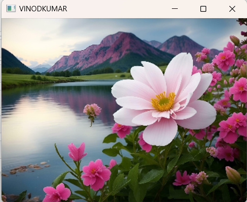

  </td>
  </tr>

   <tr>
    <td width=50%>

### ii)Write the image
```Python
import cv2
image=cv2.imread('scenery.jpg',0)
cv2.imwrite('news.jpg',image)
```
  </td>
  <td>

### OUTPUT:

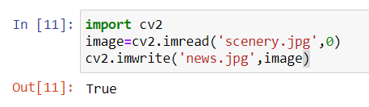

  </td>
  </tr>
  <tr>
    <td width=50%>

### iii)Shape of the Image
```Python
import cv2
image=cv2.imread('scenery.jpg',1)
print(image.shape)
```
  </td>
  <td>

### OUTPUT:
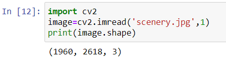


  </td>
  </tr>
  <tr>
    <td>
      
### iv)Access rows and columns
```Python
import random
import cv2
image=cv2.imread('scenery.jpg',1)
image=cv2.resize(image,(400,400))
for i in range (150,200):
for j in range(image.shape[1]):
       image[i][j]=[random.randint(0,255),
                    random.randint(0,255),
                    random.randint(0,255)] 
cv2.imshow('part image',image)
cv2.waitKey(0)
cv2.destroyAllWindows()
```
  </td>
  <td width="50%">

### OUTPUT:
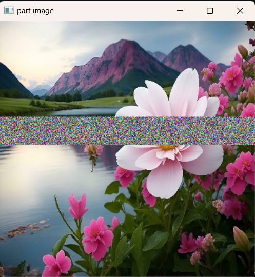

  </td>
  </tr>
  <tr>
    <td width=50%>
      
### v)Cut and paste portion of image

 ```Python
 import cv2
 image=cv2.imread('scenery.jpg',1)
 image=cv2.resize(image,(400,400))
 tag =image[150:200,110:160]
 image[110:160,150:200] = tag
 cv2.imshow('partimage1',image)
 cv2.waitKey(0)
 cv2.destroyAllWindows()
```
  </td>
  <td>
    
### OUTPUT:
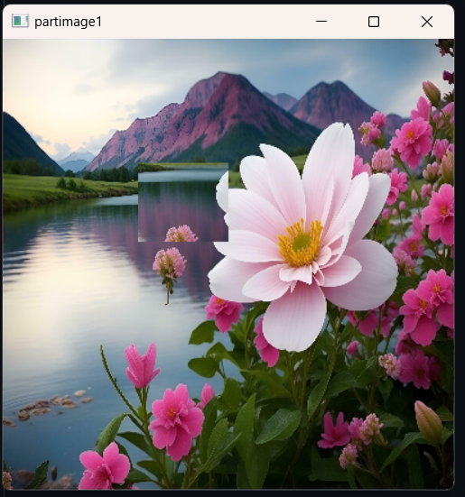

  </td>
  </tr>
</table>

### vi) BGR and RGB to HSV and GRAY
```Python
import cv2
img = cv2.imread('scenery.jpg',1)
img = cv2.resize(img,(300,200))
cv2.imshow('Original Image',img)

hsv1 = cv2.cvtColor(img,cv2.COLOR_BGR2HSV)
cv2.imshow('BGR2HSV',hsv1)

hsv2 = cv2.cvtColor(img,cv2.COLOR_RGB2HSV)
cv2.imshow('RGB2HSV',hsv2)

gray1 = cv2.cvtColor(img,cv2.COLOR_BGR2GRAY)
cv2.imshow('BGR2GRAY',gray1)

gray2 = cv2.cvtColor(img,cv2.COLOR_RGB2GRAY)
cv2.imshow('RGB2GRAY',gray2)

cv2.waitKey(0)
cv2.destroyAllWindows()
```

### OUTPUT:
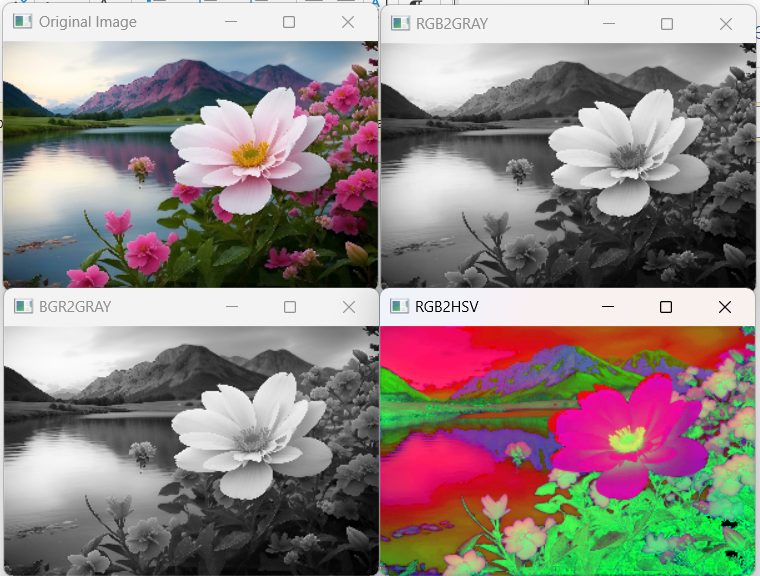
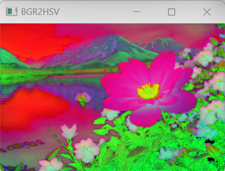


### vii) HSV to RGB and BGR
```Python
import cv2
img = cv2.imread('scenery.jpg')
img = cv2.resize(img,(300,200))

img = cv2.cvtColor(img,cv2.COLOR_BGR2HSV)
cv2.imshow('Original HSV Image',img)

RGB = cv2.cvtColor(img,cv2.COLOR_HSV2RGB)
cv2.imshow('2HSV2BGR',RGB)

BGR = cv2.cvtColor(img,cv2.COLOR_HSV2BGR)
cv2.imshow('HSV2RGB',BGR)

cv2.waitKey(0)
cv2.destroyAllWindows()
```

### OUTPUT:
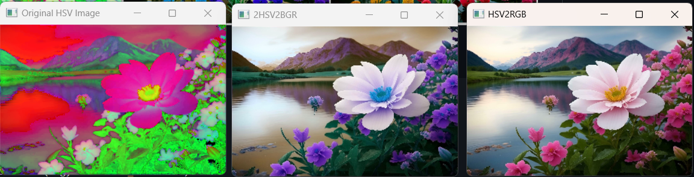


### viii) RGB and BGR to YCrCb
```Python
import cv2
img = cv2.imread('scenery.jpg')
img = cv2.resize(img,(300,200))
cv2.imshow('Original RGB Image',img)

YCrCb1 = cv2.cvtColor(img, cv2.COLOR_BGR2YCrCb)
cv2.imshow('RGB-2-YCrCb',YCrCb1)

YCrCb2 = cv2.cvtColor(img, cv2.COLOR_RGB2YCrCb)
cv2.imshow('BGR-2-YCrCb',YCrCb2)

cv2.waitKey(0)
cv2.destroyAllWindows()
```

### OUTPUT:

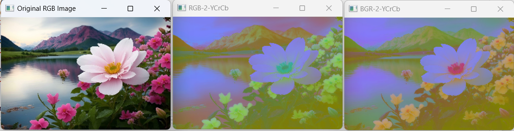


### ix) Split and merge RGB Image
```Python
import cv2
img = cv2.imread('scenery.jpg',1)
img = cv2.resize(img,(300,200))

R = img[:,:,2]
G = img[:,:,1]
B = img[:,:,0]

cv2.imshow('R-Channel',R)
cv2.imshow('G-Channel',G)
cv2.imshow('B-Channel',B)

merged = cv2.merge((B,G,R))
cv2.imshow('Merged RGB image',merged)

cv2.waitKey(0)
cv2.destroyAllWindows()
```

### OUTPUT:
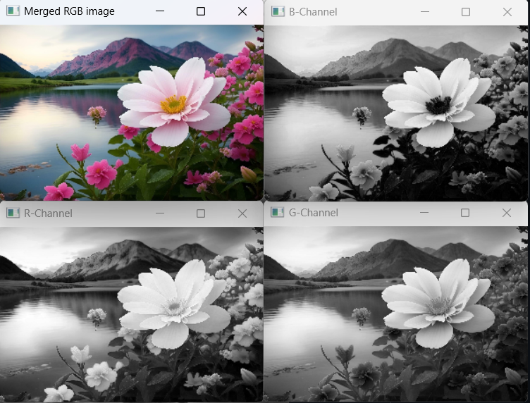


### x) Split and merge HSV Image
```Python
import cv2
img = cv2.imread("scenery.jpg",1)
img = cv2.resize(img,(300,200))
img=cv2.cvtColor(img,cv2.COLOR_RGB2HSV)

H,S,V=cv2.split(img)

cv2.imshow('Hue',H)
cv2.imshow('Saturation',S)
cv2.imshow('Value',V)

merged = cv2.merge((H,S,V))
cv2.imshow('Merged',merged)

cv2.waitKey(0)
cv2.destroyAllWindows()
```

### OUTPUT:

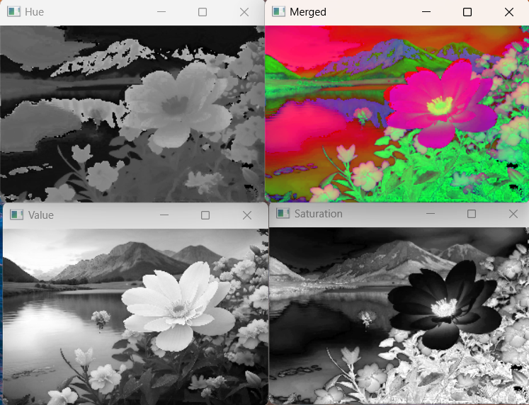


## Result:
Thus the images are read, displayed, and written ,and color conversion was performed between RGB, HSV and YCbCr color models successfully using the python program.
